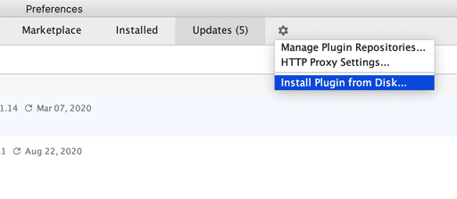

# ObjectiveSql IntelliJ Plugin
Fill the generated elements for ObjectSql, and the plugin name of IntelliJ is "ObjectiveSql"

## Install from local

Download [ObjectiveSql](./doc/object-sql-intellij-1.0.zip) and [Perference... -> Plugins -> Install Plugin from Disk... ]

## Static members

## Instance members

